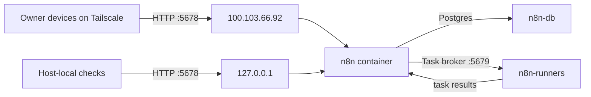
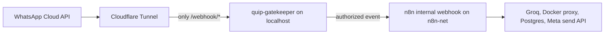

# n8n Architecture on the Dell Server

This document is the durable reference for the self-hosted n8n deployment on the Dell home server (`prsnl`). It records what is live, why it is shaped this way, and which scaling/integration options are deliberately deferred.

Last updated: 2026-06-01.

## Current State

| Item | Value |
|------|-------|
| Server path | `~/docker/n8n/` |
| Repo mirror | `docker/n8n/docker-compose.yml` |
| Editor access | `http://100.103.66.92:5678` over Tailscale |
| Local origin | `http://127.0.0.1:5678` for host-local health checks / future tunnel origins |
| Public route | None |
| n8n image | `n8nio/n8n:2.22.6` |
| runner image | `n8nio/runners:2.22.6` |
| database image | `postgres:16-alpine` |
| compose network | `n8n-net` |
| secrets file | `~/docker/n8n/.env`, chmod `600`, not committed |

Live containers:

| Container | Role | Port exposure | Limit |
|-----------|------|---------------|-------|
| `n8n` | Editor, webhook engine, workflow scheduler, task broker | `127.0.0.1:5678`, `100.103.66.92:5678` | 1 GiB |
| `n8n-runners` | External Code-node task runner | internal only | 256 MiB |
| `n8n-db` | Postgres store for workflows, credentials, executions | internal only | 256 MiB |

## Traffic Model



There is intentionally no public Cloudflare route for the editor. Docker-published ports bind to `100.103.66.92` and `127.0.0.1`, never `0.0.0.0`.

## Runtime Configuration

Core deployment choices:

- Postgres backend, not SQLite.
- External task runners, matching n8n's official hosting pattern.
- Native Python runner enabled for Python Code nodes.
- Filesystem binary data mode to keep binary payloads out of Postgres.
- Execution pruning enabled: 7 days (`168` hours) and max 10,000 executions.
- Metrics enabled at `/metrics`.
- Telemetry, personalization prompts, version notifications, and hiring banner disabled.
- `NODE_OPTIONS=--max-old-space-size=768` to keep Node heap below the 1 GiB container cap.

Execution retention is intentionally still debug-friendly:

```env
EXECUTIONS_DATA_SAVE_ON_SUCCESS=all
EXECUTIONS_DATA_SAVE_ON_ERROR=all
EXECUTIONS_DATA_SAVE_ON_PROGRESS=false
EXECUTIONS_DATA_SAVE_MANUAL_EXECUTIONS=false
```

After the first Quip/WhatsApp workflows are stable, the safe optimization is:

```env
EXECUTIONS_DATA_SAVE_ON_SUCCESS=none
EXECUTIONS_DATA_SAVE_ON_ERROR=all
EXECUTIONS_DATA_SAVE_ON_PROGRESS=false
EXECUTIONS_DATA_SAVE_MANUAL_EXECUTIONS=false
```

## Security Model

Runtime hardening:

- `n8n` and `n8n-runners` run as uid/gid `1000:1000`.
- `no-new-privileges:true` is set on runtime containers.
- n8n settings file permission enforcement is enabled.
- Code-node environment access is blocked.
- Code-node access to n8n internal files is blocked.
- Images are pinned to explicit versions, not `latest`.

Security policy is managed by env:

```env
N8N_SECURITY_POLICY_MANAGED_BY_ENV=true
N8N_PERSONAL_SPACE_SHARING_ENABLED=false
N8N_PERSONAL_SPACE_PUBLISHING_ENABLED=false
N8N_MFA_ENFORCED_ENABLED=false
```

MFA enforcement is deliberately `false` until the owner account has MFA configured. Flip it only after verifying the owner can log in with MFA, or the instance can lock out the only operator.

Secrets:

- `N8N_ENCRYPTION_KEY` must never be lost or rotated casually; it encrypts stored n8n credentials.
- `N8N_DB_PASSWORD` and `N8N_RUNNERS_AUTH_TOKEN` live only in `~/docker/n8n/.env`.
- `.env` and future secret files such as `quip-gatekeeper.env` must remain chmod `600` and uncommitted.

## Quip / WhatsApp Integration Plan

Quip is the planned WhatsApp assistant product. n8n is the orchestration layer, but the editor must remain private.

Target public ingress:



Hard requirements for Quip:

- Public route goes to a small `quip-gatekeeper`, not directly to n8n.
- Cloudflare ingress must path-lock to `/webhook/*`; root paths must hit the 404 catch-all.
- n8n editor and REST API remain Tailscale-only.
- Meta HMAC verification, sender allowlist, and `wamid` dedupe happen before n8n workflow execution.
- n8n uses credentials for Groq and Meta send tokens; Code nodes must not read secrets from `$env`.
- Tool outputs are redacted before reaching Groq.

Planned sidecars, not live yet:

| Service | Purpose | Suggested exposure |
|---------|---------|--------------------|
| `quip-gatekeeper` | Meta webhook handshake, HMAC verify, allowlist, dedupe | `127.0.0.1:8090` only |
| `quip-docker-proxy` | Read-only Docker API for container status | internal `n8n-net` only |

## Deferred Choices

### Queue Mode

Do not enable queue mode yet.

Queue mode adds Redis, workers, and more operational surface. It is the major scalability switch, but this Dell host is a Celeron with 8 GB RAM and the current workload is single-user. There is also an important compatibility issue: n8n queue mode does not support filesystem binary storage. Moving to queue mode should be paired with a binary storage decision, likely S3-compatible storage, and only after workflow volume justifies it.

### Public HTTPS Host Vars

Do not set these yet:

```env
N8N_HOST=n8n.prsnl.fyi
N8N_PROTOCOL=https
WEBHOOK_URL=https://n8n.prsnl.fyi/
```

Those are correct only if a public n8n hostname exists. The current design deliberately has no public n8n route. For Quip, the public hostname should route to the gatekeeper and only for `/webhook/*`.

### ntfy

ntfy is a soft yes for infrastructure alerts, not for Quip v1.

Good future uses:

- Uptime Kuma / Netdata real-time infra alerts.
- Backup failed / stale backup alerts.
- Reboot complete alerts.
- n8n workflow failure notifications.
- Long-running maintenance completion.

Do not use ntfy as:

- A WhatsApp template workaround.
- The Quip command interface.
- A replacement for Quip's 9 am WhatsApp digest and reminders.

If deployed later, make it private by default:

- Suggested path: `~/docker/ntfy/`.
- Suggested local origin: `127.0.0.1:8091`.
- Suggested Tailscale admin bind: `100.103.66.92:8091`.
- `auth-default-access: deny-all`.
- Separate publish and read credentials.
- No attachments initially.

## Operations

Render config locally:

```bash
N8N_DB_PASSWORD=dummy \
N8N_ENCRYPTION_KEY=dummy \
N8N_RUNNERS_AUTH_TOKEN=dummy \
docker compose -f docker/n8n/docker-compose.yml config
```

Deploy the committed compose to the server:

```bash
scp docker/n8n/docker-compose.yml pronav@100.103.66.92:~/docker/n8n/docker-compose.yml
ssh pronav@100.103.66.92 'cd ~/docker/n8n && docker compose -f docker-compose.yml up -d'
```

Verify health and exposure:

```bash
ssh pronav@100.103.66.92 '
  cd ~/docker/n8n
  docker compose -f docker-compose.yml ps
  curl -fsS http://127.0.0.1:5678/healthz
  curl -fsS http://127.0.0.1:5678/metrics | sed -n "1,8p"
  docker ps --filter name=n8n --format "{{.Names}} {{.Ports}}"
'
```

Expected exposure:

- `n8n`: `100.103.66.92:5678->5678/tcp`, `127.0.0.1:5678->5678/tcp`
- `n8n-runners`: internal only
- `n8n-db`: internal only
- no `0.0.0.0`

Check runtime hardening:

```bash
ssh pronav@100.103.66.92 '
  for c in n8n n8n-runners; do
    docker inspect "$c" --format "$c user={{.Config.User}} security={{json .HostConfig.SecurityOpt}} mem={{.HostConfig.Memory}}"
    docker exec "$c" id
  done
'
```

## Backup and Recovery Requirements

n8n now stores automation workflows, execution history, encrypted credentials, and planned Quip data. It needs the same durability discipline as project databases.

Hard requirements:

- Nightly backup of `n8n-db`.
- Separate secure backup of `N8N_ENCRYPTION_KEY`.
- Restore drill documented before relying on Quip reminders/notes.
- Weekly maintenance should check n8n backup freshness once the backup timer exists.

Losing `N8N_ENCRYPTION_KEY` means credentials stored in n8n are unrecoverable even if the database restore succeeds.

## References

- n8n environment variables: `https://docs.n8n.io/hosting/configuration/environment-variables/`
- n8n execution data pruning: `https://docs.n8n.io/hosting/scaling/execution-data/`
- n8n queue mode: `https://docs.n8n.io/hosting/scaling/queue-mode/`
- n8n metrics: `https://docs.n8n.io/hosting/configuration/configuration-examples/prometheus/`
- ntfy configuration and auth: `https://docs.ntfy.sh/config/`
- ntfy publish API: `https://docs.ntfy.sh/publish/`
